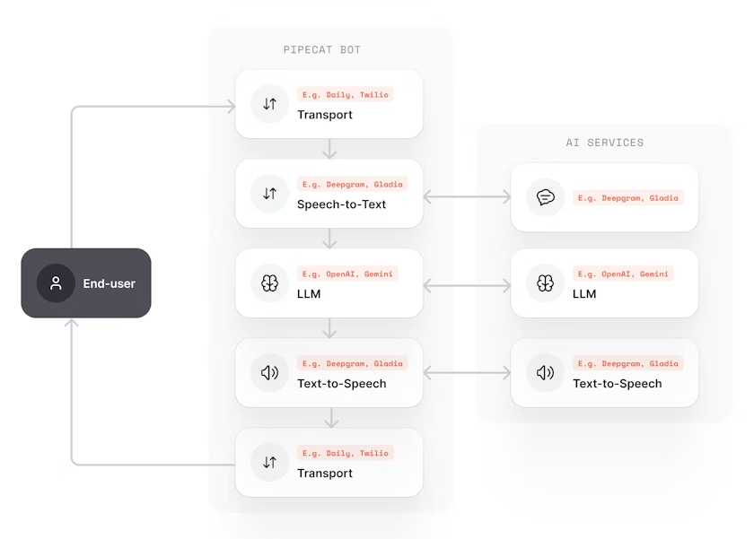

Welcome to **Part 2 of the 2025 Voice AI Guide How to Build Your Own RealTime Voice Agent.**

In this section, we’ll dive deep into **Pipecat** and create a simple **“Hello World” program** to understand how real-time voice AI works in practice.

If you have not read the part 1 [read here](./2025 Voice AI Guide How to Make Your Own Real-Time Voice Agent (Part-1).md)

## Pipecat

Pipecat is an **open-source Python framework** developed by Daily.co for building **real-time voice and multimodal conversational AI agents**. It provides a powerful yet intuitive way to orchestrate audio, video, AI services, and transport protocols to create sophisticated voice assistants, AI companions, and interactive conversational experiences

What makes Pipecat special is its **voice-first approach** combined with a **modular, composable architecture** Instead of building everything from scratch, you can focus on what makes your agent unique while Pipecat handles the complex orchestration of real-time audio processing, speech recognition, language models, and speech synthesis.

### What You Can Build with Pipecat

Pipecat enables a wide range of applications

- **Voice Assistants** - Natural, streaming conversations with AI
- **AI Companions** - Coaches, meeting assistants, and interactive characters
- **Phone Agents** - Customer support, intake bots, and automated calling systems
- **Multimodal Interfaces** - Applications combining voice, video, and images
- **Business Agents** - Customer service bots and guided workflow systems
- **Interactive Games** - Voice-controlled gaming experiences
- **Creative Tools** - Interactive storytelling with generative media

## Pipecat Architecture: How It Works

Understanding Pipecat's architecture is crucial for building effective voice agents. The framework is built around three core concepts:

### 1. Frames

**Frames** are data packages that move through your application. Think of them as containers that hold specific types of information:

- **Audio frames** - Raw audio data from microphones
- **Text frames** - Transcribed speech or generated responses
- **Image frames** - Visual data for multimodal applications
- **Control frames** - System messages like start/stop signals

### 2. Frame Processors

**Frame processors** are specialized workers that handle specific tasks. Each processor:

- Receives specific frame types as input
- Performs a specialized transformation (transcription, language processing, etc.)
- Outputs new frames for the next processor
- Passes through frames it doesn't handle

Common processor types include:

- **STT (Speech-to-Text)** processors that convert audio frames to text frames
- **LLM processors** that take text frames and generate response frames
- **TTS (Text-to-Speech)** processors that convert text frames to audio frames
- **Context aggregators** that manage conversation history

### 3. Pipelines

**Pipelines** connect processors together, creating a structured path for data to flow through your application. They handle orchestration automatically and enable **parallel processing** - while the LLM generates later parts of a response, earlier parts are already being converted to speech and played back to users.

### Voice AI Processing Flow

Here's how a typical voice conversation flows through a Pipecat pipeline:

1. **Audio Input** - User speaks → Transport receives streaming audio → Creates audio frames
2. **Speech Recognition** - STT processor receives audio → Transcribes in real-time → Outputs text frames
3. **Context Management** - Context processor aggregates text with conversation history
4. **Language Processing** - LLM processor generates streaming response → Outputs text frames
5. **Speech Synthesis** - TTS processor converts text to speech → Outputs audio frames
6. **Audio Output** - Transport streams audio to user's device → User hears response

The key insight is that **everything happens in parallel** - this parallel processing enables the ultra-low latency that makes conversations feel natural.

## Hello World Voice Agent: Complete Implementation

Now let's build a complete "Hello World" voice agent that demonstrates all the core concepts. This example creates a friendly AI assistant you can have real-time voice conversations with.

### Prerequisites

Before we start, you'll need:

- **Python 3.10 or later**
- **uv package manager** (or pip)
- **API keys** from three services:
  - [Deepgram](https://deepgram.com) for Speech-to-Text
  - [OpenAI](https://openai.com) for the language model
  - [Cartesia](https://cartesia.ai) for Text-to-Speech

### Project Setup

First, let's set up our project:

```bash
# Install Pipecat with required services
uv add "pipecat-ai[deepgram,openai,cartesia,webrtc]"
```

### Environment Configuration

Create a `.env` file with your API keys:

```bash
# .env
DEEPGRAM_API_KEY=your_deepgram_api_key_here
OPENAI_API_KEY=your_openai_api_key_here
CARTESIA_API_KEY=your_cartesia_api_key_here
```

The code is some what bigger so i have not shared the whole code you can check out the whole code [here](https://github.com/programmerraja/VoiceAgentGuide/tree/main/code/HelloWorld)

```python

async def main():
"""Main entry point for the Hello World bot."""
	bot = HelloWorldVoiceBot()

await bot.run_bot()
```

### Understanding the Code Structure

Let's break down the key components of our Hello World implementation:

#### 1. Service Initialization

```python
# Speech-to-Text service
self.stt = DeepgramSTTService(api_key=os.getenv("DEEPGRAM_API_KEY"))

# Language Model service
self.llm = OpenAILLMService(api_key=os.getenv("OPENAI_API_KEY"), model="gpt-3.5-turbo")

# Text-to-Speech service
self.tts = CartesiaTTSService(api_key=os.getenv("CARTESIA_API_KEY"), voice_id="...")
```

Each service is a **frame processor** that handles a specific part of the voice AI pipeline.

#### 2. Pipeline Configuration

```python
pipeline = Pipeline([
    transport.input(),              # Audio input from browser
    self.stt,                      # Speech → Text
    self.context_aggregator.user(),# Add to conversation history
    self.llm,                      # Generate response
    self.tts,                      # Text → Speech
    transport.output(),            # Audio output to browser
    self.context_aggregator.assistant(), # Save response to history
])
```

The pipeline defines the **data flow** each processor receives frames, transforms them, and passes them to the next processor.

#### 3. Event-Driven Interactions

```python
@transport.event_handler("on_first_participant_joined")
async def on_participant_joined(transport, participant):
    # Trigger bot to greet the user
    await task.queue_frame(LLMMessagesFrame(self.messages))
```

Event handlers manage the **conversation lifecycle** - when users join/leave, when they start/stop speaking, etc.

The diagram below shows a typical voice assistant pipeline, where each step happens in real-time:



### Running Your Hello World Bot

1. **Save the code** as `hello_world_bot.py`

2. **Run the bot**:

   ```bash
   python hello_world_bot.py
   ```

3. **Open your browser** to `http://localhost:7860`

4. **Click "Connect"** and allow microphone access

5. **Start talking!** Say something like "Hello, how are you?"

The bot will:

- Listen to your speech (STT)
- Process it with OpenAI (LLM)
- Respond with natural speech (TTS)
- Remember the conversation context

For more examples and advanced features, check out the [Pipecat documentation](https://docs.pipecat.ai) and [example repository](https://github.com/pipecat-ai/pipecat-examples).\*

## What Next?

Now that you’re familiar with **Pipecat** and can build your own real-time voice agent, it’s time to take the next step.

In the upcoming part, we’ll explore **how to run all models locally even on a CPU** and build a fully offline voice agent.

Stay tuned for the next part of the **2025 Voice AI Guide!**
